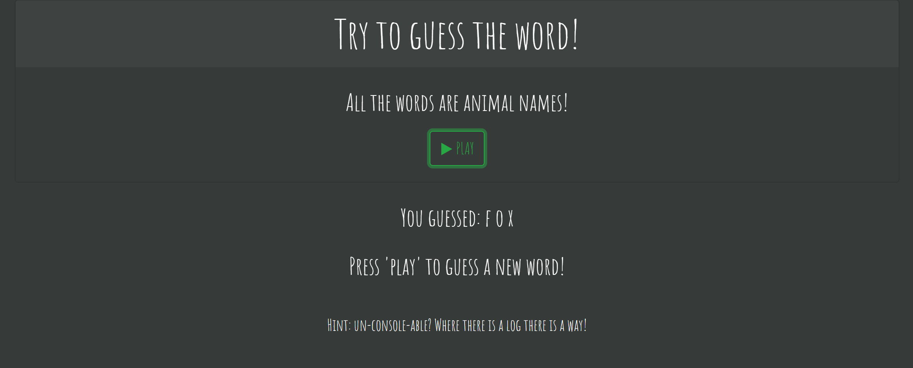

# Hangman

This is a web browser based game that uses alerts and prompts for a classic "hangman game" experience.

## Game Logic

When the user enters the page they can click on "play" to initiate the game imstead of just jumping into alerts as soon as the page loads. 

Once the game starts the user has to guess a randomly selected word; the hint is provided for the user so they dont have to guess blindly. The game tracks the words the user guessed correctly and displays them in an alert. When all the words have been guessed the user will get a "congratulations" message and they can select to "play" again and a new word will be generated without having to "refresh" the browser. 

## Coding:

This game uses prompts and alerts for the basic logic. We also used a function as an event listener to initiate the game logic. The game logic uses if/else statements nested inside a while statement. For the full code look at the repository.

### Special thanks to:

Font:
https://fonts.google.com/

Front-End Library:
https://getbootstrap.com/

Icons:
https://coolsymbol.com/

### Important Links:

GitHub Repository: https://github.com/CookieChef/Hangman.git

Game Link: https://cookiechef.github.io/Hangman/

